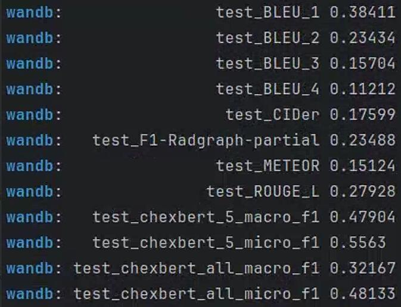
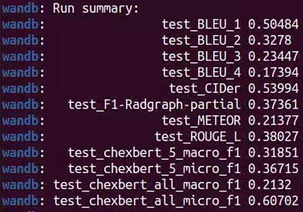

# FSE

Factual Serialization Enhancement: A Key Innovation for Chest X-ray Report Generation. 

## Citations

If you use or extend our work, please cite our paper at ***.

```
@misc{liu2024factual,
      title={Factual Serialization Enhancement: A Key Innovation for Chest X-ray Report Generation}, 
      author={Kang Liu and Zhuoqi Ma and Mengmeng Liu and Zhicheng Jiao and Xiaolu Kang and Qiguang Miao and Kun Xie},
      year={2024},
      eprint={2405.09586},
      archivePrefix={arXiv},
      primaryClass={eess.IV}
}
```

## Requirements

- `torch==2.1.2+cu118`
- `transformers==4.23.1`
- `torchvision==0.16.2+cu118`
- `radgraph==0.09`
- Due to the specific environment of RadGraph, we constructed two virtual environments: one for extracting factual serialization from radiology reports using the `structural entities approach` (see `knowledge_encoder/radgraph_requirements.txt` for details), and the other for running the overall FSE framework excluding the `structural entities approach` (see `requirements.txt` for more information).


## Checkpoints

You can download checkpoints of FSE as follows:

- For `MIMIC-CXR`, you can download checkpoints from [here](https://pan.baidu.com/s/17-hlaUR6dPgwhXWhZyw2tQ), and its code is `MK13`. 

- For `IU X-Ray`, you can download checkpoints from [here](https://pan.baidu.com/s/1SPSNGKEwSKlywUVDFxv_eg), and its code is `MK13`.

## Datasets

We use two datasets (IU X-Ray and MIMIC-CXR) in our paper.

- For `IU X-Ray`, you can download medical images from [here](https://drive.google.com/file/d/1c0BXEuDy8Cmm2jfN0YYGkQxFZd2ZIoLg/view?usp=sharing).

- For `MIMIC-CXR`, you can download medical images from [here](https://physionet.org/content/mimic-cxr/2.0.0/). You can download `medical reports` from [Google Drive](https://drive.google.com/file/d/1iWdFINSAJ7F97I4rTGddIziJAb-1sL3l/view?usp=drive_link). Note that you must apply with your license of [PhysioNet](https://physionet.org/content/mimic-cxr-jpg/2.0.0/).


NOTE: The `IU X-Ray` dataset is small, and thus the variance of the results is large. 

## Reproducibility on MIMIC-CXR

### Extracting factual serialization using structural entities approach

1. Config RadGraph environment based on `knowledge_encoder/factual_serialization.py`
   ===================environmental setting=================
   
    Basic Setup (One-time activity)

   a. Clone the DYGIE++ repository from [here](https://github.com/dwadden/dygiepp). This repository is managed by Wadden et al., authors of the paper [Entity, Relation, and Event Extraction with Contextualized Span Representations](https://www.aclweb.org/anthology/D19-1585.pdf).
    ```bash
   git clone https://github.com/dwadden/dygiepp.git
    ```
   b. Navigate to the root of repo in your system and use the following commands to set the conda environment:
    ```bash
   conda create --name dygiepp python=3.7
   conda activate dygiepp
   cd dygiepp
   pip install -r requirements.txt
   conda develop .   # Adds DyGIE to your PYTHONPATH
   ```
   c. Activate the conda environment:
    
    ```bash
   conda activate dygiepp
    ```
    Notably, for our RadGraph environment, you can refer to `knowledge_encoder/radgraph_requirements.yml`.
   
3. Config `radgraph_model_path` and `ann_path` in `knowledge_encoder/factual_serialization.py`. The former can be downloaded from [here](https://physionet.org/content/radgraph/1.0.0/), and the latter, `annotation.json`, can be obtained from [here](https://drive.google.com/file/d/1DS6NYirOXQf8qYieSVMvqNwuOlgAbM_E/view?usp=sharing). Note that you can apply with your license of [PhysioNet](https://physionet.org/content/mimic-cxr-jpg/2.0.0/).
4. Set the local path in `config/finetune_config.yaml` for images and checkpoints, such as `mimic_cxr_image_dir` and `chexbert_model_checkpoint`
5. Run the `knowledge_encoder/factual_serialization.py` to extract factual serialization for each sample.

Notably,`scibert_scivocab_uncased` can be downloaded from [here](https://huggingface.co/allenai/scibert_scivocab_uncased). To calculate the NLG and CE metrics, you should download these checkpoints. `chexbert.pth` can be downloaded from [here](https://stanfordmedicine.app.box.com/s/c3stck6w6dol3h36grdc97xoydzxd7w9). `distilbert-base-uncased` can be downloaded from [here](https://huggingface.co/distilbert/distilbert-base-uncased). `bert-base-uncased` can be downloaded from [here](https://huggingface.co/google-bert/bert-base-uncased). `radgraph` can be downloaded from [here](https://physionet.org/content/radgraph/1.0.0/). . 

### Conducting the first stage (i.e., training cross-modal alignment module)

Run `bash pretrain_mimic_cxr.sh` to pretrain a model on the MIMIC-CXR data.

### Similar historical cases for each sample

1. Config `--load` argument in `pretrain_inference_mimic_cxr.sh`
2. Run `bash pretrain_inference_mimic_cxr.sh` to retrieve similar historical cases for each sample, forming `mimic_cxr_annotation_sen_best_reports_keywords_20.json`.

### Conducting the second stage (i.e., training report generation module)

1. Config `--load` argument in `finetune_mimic_cxr.sh`
2. Run `bash finetune_mimic_cxr.sh` to generate reports based on similar historical cases.

### Test 

1. You must download the medical images, their corresponding reports (i.e., `mimic_cxr_annotation_sen_best_reports_keywords_20.json`),  and checkpoints (i.e., `finetune_model_best.pth`) in Section Datasets and Section Checkpoints, respectively.

2. Config `--load` and `--mimic_cxr_ann_path`arguments in `test_mimic_cxr.sh`

3. Run `bash test_mimic_cxr.sh` to generate reports based on similar historical cases.

4. Results (i.e., FSE-5, $M_{gt}=100$) on MIMIC-CXR are presented as follows:

<div align=center></div>

## Reproducibility on IU X-ray

### Results (i.e., FSE-20, $M_{gt}=60$) on IU-Xray are presented as follows:

<div align=center></div>

## Acknowledgement

- [R2Gen](https://github.com/zhjohnchan/R2Gen) Some codes are adapted based on R2Gen.
- [R2GenCMN](https://github.com/zhjohnchan/R2GenCMN) Some codes are adapted based on R2GenCMN.
- [MGCA](https://github.com/HKU-MedAI/MGCA) Some codes are adapted based on MGCA.

## References

[1] Chen, Z., Song, Y., Chang, T.H., Wan, X., 2020. Generating radiology reports via memory-driven transformer, in: EMNLP, pp. 1439–1449. 

[2] Chen, Z., Shen, Y., Song, Y., Wan, X., 2021. Cross-modal memory networks for radiology report generation, in: ACL, pp. 5904–5914. 

[3] Wang, F., Zhou, Y., Wang, S., Vardhanabhuti, V., Yu, L., 2022. Multigranularity cross-modal alignment for generalized medical visual representation learning, in: NeurIPS, pp. 33536–33549.
