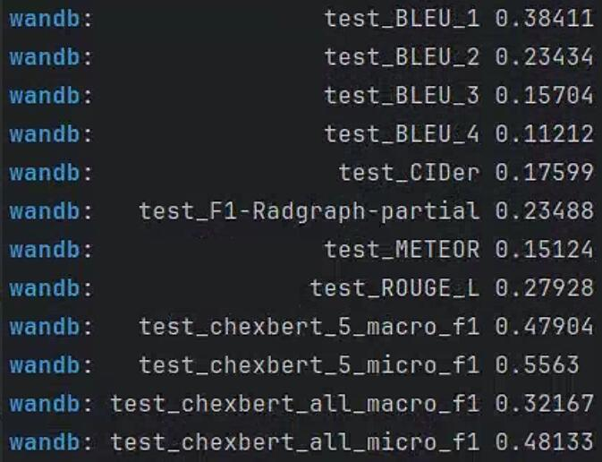
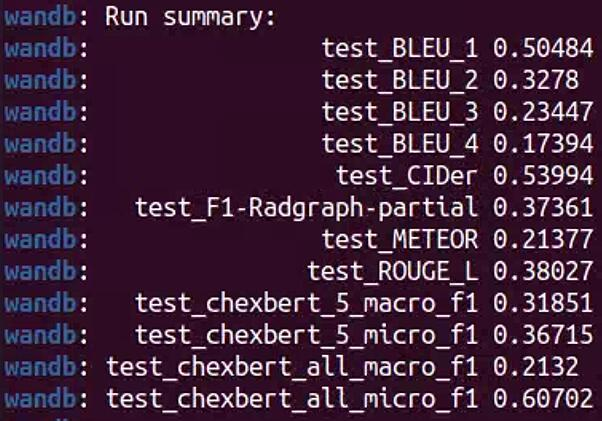

<div align="center">

# 📋 FSE: Factual Serialization Enhancement for Chest X-ray Report Generation

[](https://arxiv.org/abs/2405.09586)&nbsp;&nbsp;&nbsp;
[](https://www.sciencedirect.com/science/article/pii/S0957417426014636)&nbsp;&nbsp;&nbsp;
[](https://pan.baidu.com/s/17-hlaUR6dPgwhXWhZyw2tQ)


</div>

---


## 📚 Citation

If you use or extend this work, please cite:

```bibtex
@article{liu-eswa-2026-fse,
	title = {Factual Serialization Enhancement: A Key Innovation for Chest X-ray Report Generation},
	journal = {Expert Systems with Applications},
	pages = {132550},
	year = {2026},
	issn = {0957-4174},
	doi = {10.1016/j.eswa.2026.132550},
	url = {https://www.sciencedirect.com/science/article/pii/S0957417426014636},
	author = {Kang Liu and Zhuoqi Ma and Mengmeng Liu and Zhicheng Jiao and Xiaolu Kang and Qiguang Miao and Kun Xie},
}
```

---

## 🛠️ Requirements

* Python 3.9
* `torch==2.1.2+cu118`
* `transformers==4.23.1`
* `torchvision==0.16.2+cu118`
* `radgraph==0.09`

> ⚠️ Due to RadGraph's specific environment, we recommend **two separate virtual environments**:
>
> * **RadGraph environment**: for structural entity extraction (`knowledge_encoder/radgraph_requirements.txt`)
> * **Main FSE environment**: for running the rest of the framework (`requirements.txt`)

---

## 📂 Datasets

* **IU X-Ray**
  📥 Images & Reports: [Google Drive](https://drive.google.com/file/d/1c0BXEuDy8Cmm2jfN0YYGkQxFZd2ZIoLg/view?usp=sharing)

* **MIMIC-CXR**
  📥 Images: [PhysioNet](https://physionet.org/content/mimic-cxr/2.0.0/) (license required)
  📥 Reports: [Google Drive](https://drive.google.com/file/d/1iWdFINSAJ7F97I4rTGddIziJAb-1sL3l/view?usp=drive_link)

---

## 💾 Pretrained Checkpoints

* **MIMIC-CXR:**
  [Baidu Netdisk](https://pan.baidu.com/s/17-hlaUR6dPgwhXWhZyw2tQ) (code: `MK13`)

* **IU X-Ray:**
  [Baidu Netdisk](https://pan.baidu.com/s/1SPSNGKEwSKlywUVDFxv_eg) (code: `MK13`)

---

## ⚙️ Quick Reproducibility Guide

### 1. Setup RadGraph Environment for Factual Serialization Extraction

```bash
git clone https://github.com/dwadden/dygiepp.git
conda create -n dygiepp python=3.7
conda activate dygiepp
cd dygiepp
pip install -r requirements.txt
conda develop .
```
> Refer to `knowledge_encoder/radgraph_requirements.yml` for additional dependencies.

### 2. Download RadGraph Models and Annotations

* RadGraph model: [PhysioNet RadGraph](https://physionet.org/content/radgraph/1.0.0/)
* Annotation JSON: [Google Drive](https://drive.google.com/file/d/1DS6NYirOXQf8qYieSVMvqNwuOlgAbM_E/view?usp=sharing) (requires PhysioNet license)

### 3. Configure Paths in `knowledge_encoder/factual_serialization.py`

Set local paths for:

* `radgraph_model_path`
* `ann_path` (annotation.json)

### 4. Extract Factual Serialization

Run:

```bash
python knowledge_encoder/factual_serialization.py
```
### 5. Pretrain Cross-Modal Alignment Module (Stage 1)

```bash
bash pretrain_mimic_cxr.sh
```

### 6. Retrieve Similar Historical Cases

Configure `--load` argument in `pretrain_inference_mimic_cxr.sh`, then run:

```bash
bash pretrain_inference_mimic_cxr.sh
```

### 7. Fine-tune Report Generation Module (Stage 2)

Configure `--load` argument in `finetune_mimic_cxr.sh`, then run:

```bash
bash finetune_mimic_cxr.sh
```

### 8. Test & Generate Reports

Download images, reports (`mimic_cxr_annotation_sen_best_reports_keywords_20.json`), and checkpoints (`finetune_model_best.pth`).

Configure `--load` and `--mimic_cxr_ann_path` in `test_mimic_cxr.sh`, then run:

```bash
bash test_mimic_cxr.sh
```

## 📈 Results

* MIMIC-CXR (FSE-5, \$M\_{gt}=100\$):

<div align="center"></div>

* IU X-Ray (FSE-20, \$M\_{gt}=60\$):

<div align="center"></div>

---

## 🙏 Acknowledgements

- [R2Gen](https://github.com/zhjohnchan/R2Gen) Some codes are adapted based on R2Gen.
- [R2GenCMN](https://github.com/zhjohnchan/R2GenCMN) Some codes are adapted based on R2GenCMN.
- [MGCA](https://github.com/HKU-MedAI/MGCA) Some codes are adapted based on MGCA.

## 🔗 References

[1] Chen, Z., Song, Y., Chang, T.H., Wan, X., 2020. Generating radiology reports via memory-driven transformer, in: EMNLP, pp. 1439–1449. 

[2] Chen, Z., Shen, Y., Song, Y., Wan, X., 2021. Cross-modal memory networks for radiology report generation, in: ACL, pp. 5904–5914. 

[3] Wang, F., Zhou, Y., Wang, S., Vardhanabhuti, V., Yu, L., 2022. Multigranularity cross-modal alignment for generalized medical visual representation learning, in: NeurIPS, pp. 33536–33549.
